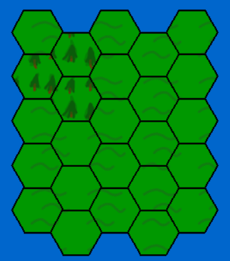

# Muskets_&_swords_NewDawn (M&SNewDawn)

## A development project for school and learning, also funny strategic game to play!

This project was created with a goal for creating a turn base, point and click strategy game, this game will as it will be is still WIP so don't expect any major thing to happen, also what will you can do when it will be finished:

* Making your own levels with troops and have adjustable map for your needs
* Play the campaing that will lead you throuth historical battles of Europe
* Play againts or with your friends bouth on one device and multiplayer
* You may choose from various fractions like Germans, Austrians, Franch, English etc...
* You can choose from various amount of troops like: Line infantri, Horse cavalery etc...
* Have a great time playing with sounds and somewhat good graphics

## Coding and prograss

For first this will be the updated chapter, well in this chapter we'll discous how is the progress is going and what is the current problem, I'm mainly focusing on right now and for the mean time when I learn how to add diagrams and stuff, I'll make something,  me and project structuring, well as i sayed, I'll try my best.

### Main prograss bar(can be extended/edited in future)
- `[✓]` Have an idea
- `[✓]` Make proper hex generating
- `[✓]` Make hexes with pictures
- `[✓]` Make hexes as Nodes
- `[~]` Make a full graph structure
- `[~]` Make graphics for all hexes
- `[~]` Make some levels
- `[✗]` Add strops
- `[✗]` Make or look for algorith that will say where your mouse is(on what hex in hex grid)
- `[✗]` Make a main menu
- `[✗]` make option menu
- `[✗]` look on how to make enemy ai or algorithm
- `[✗]` finish the project

+ `✓` --> Done
+ `~` --> In progress
+ `✗` --> Not in progress, yet

### Prograss photos and diagrams(if i will add one)

## how to run the game for your self

The best way is to clone the repository go to main.py file and in a IDE(integrated development environment) like VScode or others or in command prompt, first install libs. in requiarments than run the main file and the game should start up and should be working normaly, yup and if you dont have instaled the module(libralies) nedeed look at the dependencies file there will be all the outside libs you need to download
Enjoy your plaing

## If you want to help me don't hasitate:
I'm always open to knowing more and well as I sayed I'm still learning, so if you want to help me don't hasitate and fork my code but always when you make something new or want to emprove something what was mine code just properly comment it before commiting, thanks

